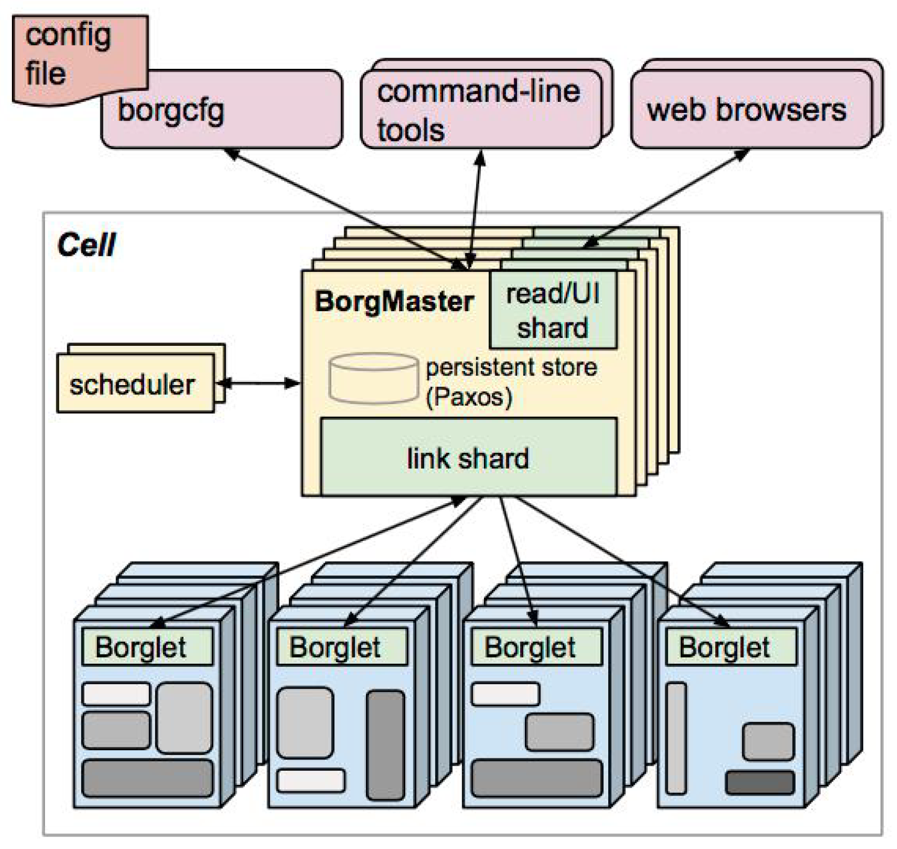
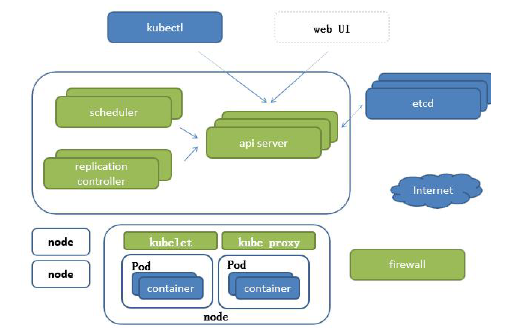
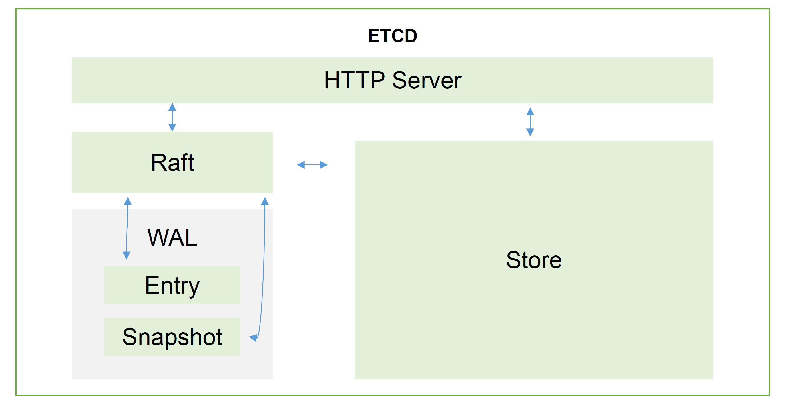
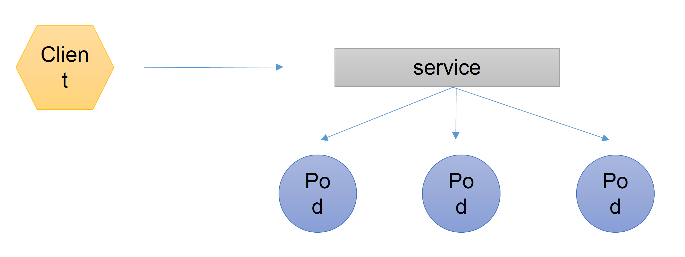
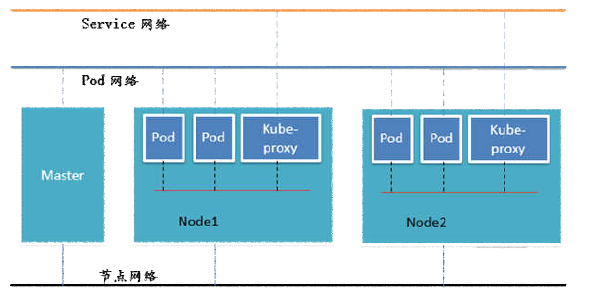
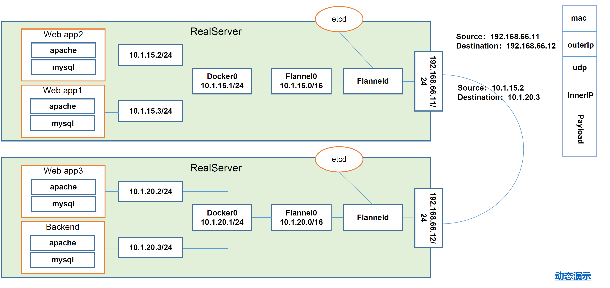

# Kubernetes基础概念

## 一. 组件说明

- K8s架构图

组件说明：

1. `API server`：所有服务访问统一入口
2. `CrontrollerManager`：维持副本期望数目
3. `Scheduler`：负责介绍任务，选择合适的节点进行分配任务
4. `Etcd`：键值对数据库，存储K8s集群所有重要信息（持久化）
5. `Kubelet`：直接和容器引擎（Docker）交互实现容器的生命周期管理
6. `Kube-Proxy`：负责写入规则到iptables,IPVS实现容器访问映射
7. `CoreDNS`：可以为集群中的SCV创建一个域名IP的对应关系解析
8. `DashBoard`： 给K8s集群提供一个B/S结构的访问体系
9. `IngressController`：官方只能实现四层代理，Ingress可以实现七层
10. `Fedetation`：提供一个可以跨集群中心多K8s的统一管理功能
11. `Prometheus`：提供K8s集群的监控能力
12. `ELk`： 提供K8s集群日志统一分析平台1

- Etcd架构

##　二．Pod概念

- 自助式Pod

- 控制器管理的Pod

  1. ReplicationController&ReplicationSet&Deployment

     > ReplicationController用来确保容器应用的副本数始终保持在用户定义的副本数，即如果有容器异常退出，会自动创建新的 Pod 来替代;而如果异常多出来的容器也会自动回收。在新版本的 Kubernetes中建议使用ReplicaSet 来取代ReplicationControlle
     >
     > ReplicaSet跟ReplicationController没有本质的不同，只是名字不一样，并且ReplicaSet支持集合式的selector
     >
     > 虽然ReplicaSet可以独立使用,但一般还是建议使用Deployment来自动管理ReplicaSet ，这样就无需担心跟其他机制的不兼容问题（比如ReplicaSet 不支持rolling-update 但 Deployment支持)

  2. Deployment（ReplicaSet）

     > Deployment为Pod和ReplicaSet提供了一个`声明式定义`（declarative）方法，用来替代前ReplicationController来方便的管理应用。典型的应用场景包括：
     >
     > - 定义Deployment来创建Pod和ReplicaSet
     > - 滚动升级和回滚应用
     > - 扩容和缩容
     > - 暂停和继续Deployment
  
  3. HPA（HorizontalPodAutoScale）
  
     > Horizontal Pod Autoscaling仅适用于Deployment和ReplicaSet，在V1版本中仅支持Pod的CPU利用率扩容，在vlalpha版本中，支持根据内存和用户自定义的metric来扩缩容
  
  4. StatefullSet
  
     > StatefulSet是为了解决有状态的服务的问题（对应Deployment和ReplicaSets是为无状态服务器而设计），其应用场景包括：
     >
     > - 稳定的持久化存储，即Pod重新调度后还是能访问到相同持久化数据，基于PVC来实现
     > - 稳定的网络标志，即Pod重新调度后其PodName和HostName不变，基于Headless Service（即没有Cluster IP的Service）来实现
     > - 有序部署，有序扩展，即Pod的有顺序的，在部署或者扩展的时候要依据定义的顺序依次进行（即从0到N\-1，在下一个Pod运行之前所有的Pod必须是Running和Ready的状态），基于Init Containers来实现
     > - 有序收缩，有序删除（即从N\-1到0）
  
  5. DaemonSet
  
     > DaemonSet确保全部（或者一些）Node上运行一个Pod的副本，当有Node加入集群时，也会为他们新增一个Pod。当有Node从集群移除时，这些Pod也会被回收，删除DaemonSet将会删除它创建所有的Pod
     >
     > 使用DaemonSet的一些典型用法:
     >
     > - 运行集群存储Daemon，例如在每个Node上运行glusterd，ceph
     > - 在每个Node上运行日志收集daemon，例如fluentd，logstash
     > - 在每个Node上运行监控daemon，例如Prometheus Node exporter
  
  6. Job,Cronjob
  
     > Job负责批处理任务，即仅执行一次的任务，它保证批处理任务的一个或多个Pod成功结束
     >
     > Cron Job管理基于时间的Job，即：
     >
     > - 在给的的时间只运行一次
     > - 周期性的在给定时间点运行

服务发现

## 三. 网络通信方式

> Kubernetes的网络模型假定了所有的Pod都在一个可以直接连通的扁平网络空间中，这在GCE（Google Compute Engine）里面是现成的网络模型，Kubernetes假定这个网络已经存在。而在私有云搭建的Kubernetes集群，就不能假定这个网络已经存在了。我们需要自己实现这个网络的假设，将不同节点上Docker容器直接的相互访问先打通，然后运行Kubernetes

- 同一个Pod内的多容器之间：lo

  > 同一个Pod共享同一个网络命名空间，共享同一个Linux协议栈

- 各Pod之前的通信：Overlay Network

  > Pod1到Pod2
  >
  > - Pod1与Pod2不在同一台主机，Pod的地址是与Docker0在同一个网段的，但Docker0网段与宿主机网卡是两个完全不同的IP网段，并且不同Node之前的通信只能通过宿主机的物理网卡进行。将Pod的IP和所在Node的IP关联起来，通过这个关联让Pod可以互相访问
  >
  > - Pod1与Pod2在同一起台机器，又Docker0网桥直接转发请求Pod2，不需要经过Flannel

- Pod与Service之间的通讯：各节点的iptables规则/LVS

  > iptables维护和转发或LVS

- Pod到外网

  > Pod向外网发送请求，查找路由表，转发数据包到宿主机的网卡，宿主机网卡完成路由选择后，iptables执行Masquerade，把源IP更改为宿主机网卡的IP，然后向外网服务器发送请求

- 外网访问Pod：Service

  

网络解决方案（Kubernetes+Flannel）

> Flannel是CoreOS团队针对Kubernetes设计的一个网络规划服务，简单来说，它的功能是让集群中的不同节点主机创建的Docker容器都具有全集群唯一的虚拟IP地址。而且它还能在这些IP地址之间建立一个覆盖的网络（OverlayNetwork），通过这覆盖网络，将数据包原封不动的传递到目标容器内

Etcd之Flannel提供说明：

- 存储管理Flannel可分配的IP地址段资源
- 监控Etcd中每个Pod的实际地址，并在内存中建立维护Pod节点路由表

