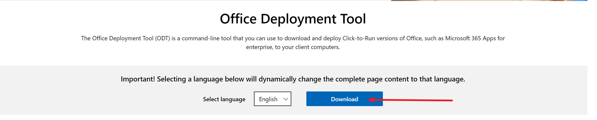
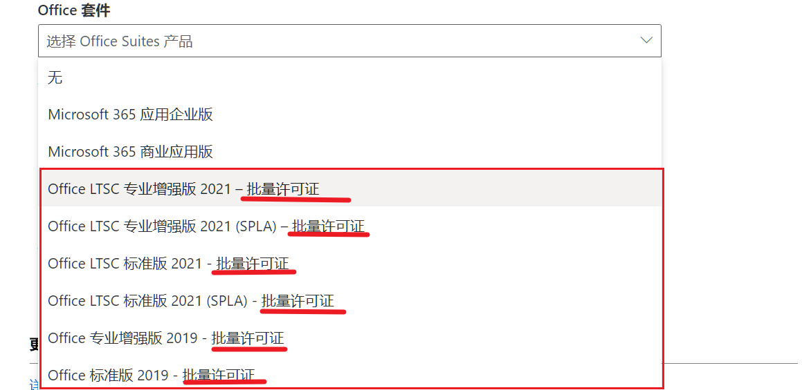

# Microsoft Office Custom Tools

> @Editor: Typora
>
> @Author: Austin (From Chengdu.China)
>
> @HomePage: [AustinFairyland](https://github.com/AustinFairyland)
>
> @OperatingSystem: Windows 11 Professional Workstation 22H2

[](https://t.me/FairyLtd) [](https://github.com/AustinFairyland) [](https://interestingbooks.gitbook.io/) [](https://github.com/AustinFairyland) [](https://github.com/AustinFairyland) [](https://github.com/AustinFairyland) [](https://github.com/AustinFairyland) [](https://github.com/AustinFairyland) [](https://wakatime.com/@fa851759-c657-4b1e-8bcb-3ec3a693a2cd) [](https://github.com/AustinFairyland) 

> 相关下载: [Box](https://app.box.com/s/4dnxgxmn43xykmp2t46mgapeuy3x63wj) [私有云服务](https://mapping.fairy.host:1443/share/files/MicrosoftOfficeCustomTools.zip) 

1. office部署工具: [部署工具](https://www.microsoft.com/en-us/download/details.aspx?id=49117) 



2. office自定义版本工具: [自定义配置文件](https://config.office.com/deploymentsettings) 



3. 基于KMS的GVLK: [GVLK](https://learn.microsoft.com/zh-cn/deployoffice/vlactivation/gvlks) 


- 下载

  ```bash
  setup /download config.xml
  ```

- 安装

  ```bash
  setup /configure config.xml
  ```

