# 工作总结

## 1.服务器资源

**SSH禁用root登录, 请输入普通用户登录后进行`su - root`或使用`sudo`**

| Server       |                                                     |
| :----------- | :-------------------------------------------------- |
| IP           | 10.\*.\*.\*                                         |
| User         | r\*\*\*\*\*                                         |
| Password     | R\*\*\*\*\*\*\*\*\*                                 |
| RootPassword | N\*\*\*\*\*\*\*\*\*\*\*                             |
| CPU          | Intel(R) Xeon(R) Gold 5320 CPU @ 2.20GHz 8Core \* 2 |
| GPU          | Tesla A10 24G \* 3                                  |
| Memory       | 32GB                                                |
| Disk         | /: 200GB, /data1: 500GB                             |
| SSH          | \[r\*\*\*\*@\]10.\*.\*.\*                           |

## 2.显卡驱动

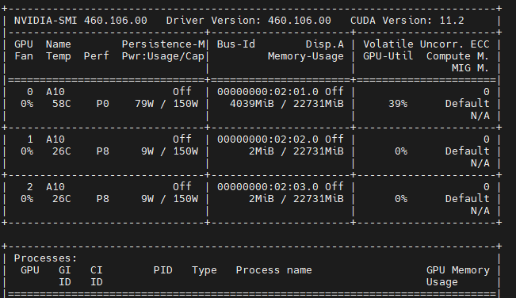

## 3.CUDA驱动

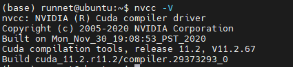

## 4.Cudnn驱动

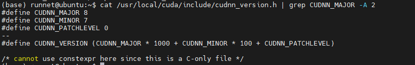

## 5.Anaconda

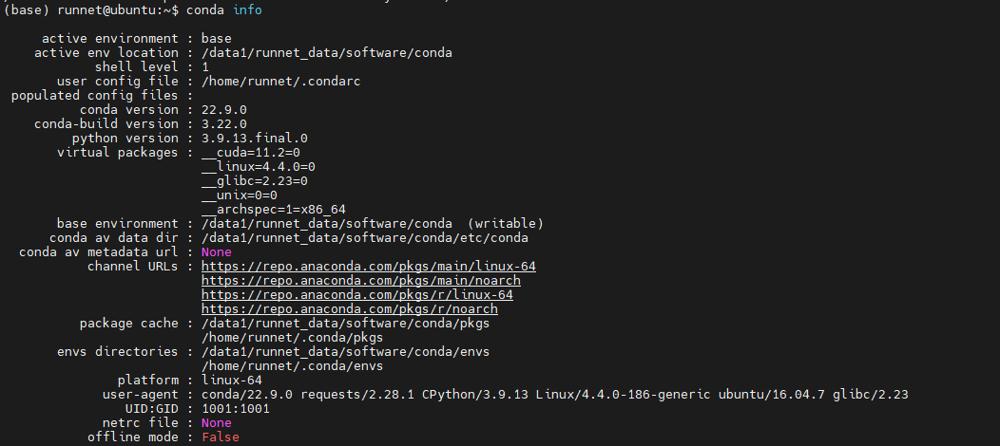

## 6.程序运行环境

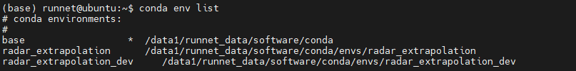

## 7.Pytorch/Pip依赖

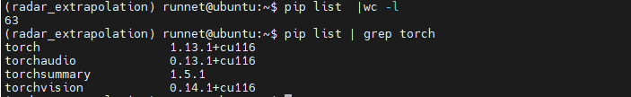

## 8.制作数据集

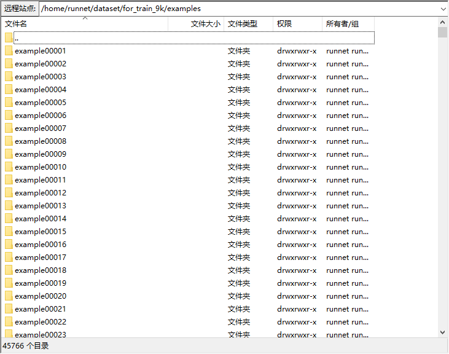

## 9.模型训练(外推模型)

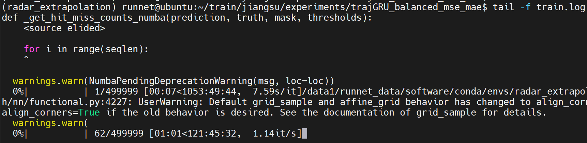

## 10.Gan(外推效果图像清晰化)数据集

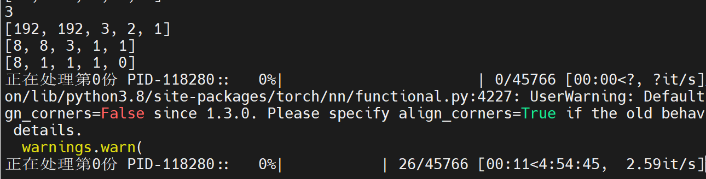

## 11.模型训练(Gan模型)

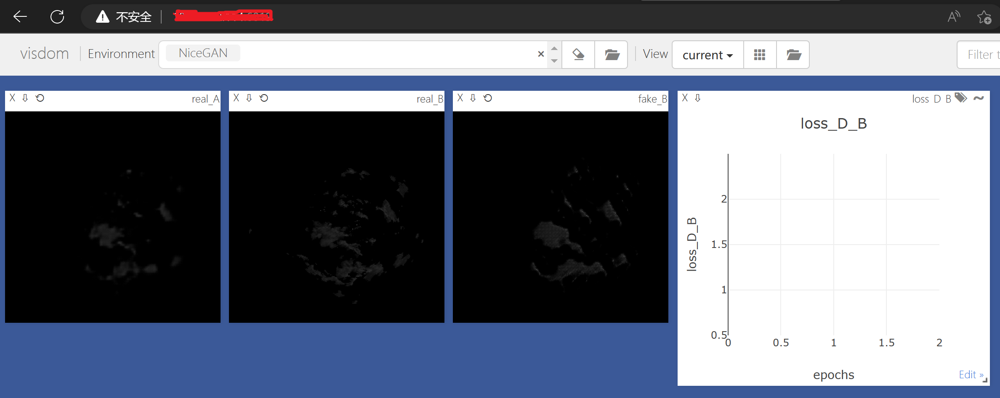

## 12.程序运行脚本(等模型训练完成)

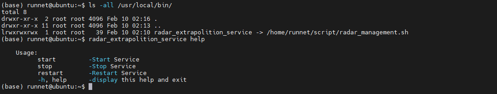

```shell
#!/bin/bash
# @File: radar_management.sh
# @Editor: PyCharm
# @Author: Alice(From Chengdu.China)
# @HomePage: https://github.com/AliceEngineerPro
# @CreatedTime: 2023/2/10 19:49

# Global Variables
project_home="/home/runnet/app/radar_extrapolation_hainan/"
conda_environment_name="radar_extrapolation"

# Change Anaconda --> $(ENVIRONMENT_NAME)
environment_config() {
  if [ "$(conda --version | wc -l)" = 1 ]; then
    conda activate "$conda_environment_name"
  else
    {
      local str_a="Error: Not Found Anaconda"
      local str_b="Please install Anaconda or Add Anaconda to the environment variable (User or System)"
      printf "\033[31m%s\n \033[0m" "$str_a"
      printf "\033[31m%s\n \033[0m" "$str_b"
      exit 1
    }
  fi
}

# Change User --> root
static_user() {
  if [ "$(whoami)" = root ]; then
    environment_config
  else
    {
      printf "\033[31mInsufficient Permissions, Use root Privileges\n \033[0m"
      exit 1
    }
  fi
}

run_project() {
  # static_user
  mkdir -p "${project_home}/logs"
  local str_a="Please check program path"
  cd "${project_home}" || printf "\033[31mError: Not Found %s\n \033[0m" "${project_home}" && printf "\033[31m %s \033[0m" "$str_a"
  cp run.py radar_run.py
  nohup /data1/runnet_data/software/conda/envs/radar_extrapolation/bin/python -u radar_run.py >./logs/radar_run.log 2>&1 &
  printf "Output log file to: %s/logs/run.log\n" "$project_home"
}

start_project() {
  if [ "$(ps -ef | grep -v grep | grep radar_run | wc -l)" = 1 ]; then
    printf "Running\n"
  else
    {
      run_project
    }
  fi
}

stop_project() {
  if [ "$(ps -ef | grep -v grep | grep radar_run | wc -l)" = 1 ]; then
    kill -9  "$(ps -ef | grep -v grep | grep radar_run | awk '{print $2}')"
  else
    {
      printf "Please execute start\n"
    }
  fi
}

restart_project() {
  stop_project
  printf "wait 10s\n"
  sleep 10
  start_project
}

# main
while true; do
  case $1 in
  start)
    start_project
    break
    ;;
  stop)
    stop_project
    break
    ;;
  restart)
    restart_project
    break
    ;;
  -h | help)
    printf "
    Usage: 
          start         -Start Service
          stop          -Stop Service
          restart       -Restart Service
          -h, help      -display this help and exit\n"
    break
    ;;
  *)
    options_error="Invalid option, Please execute -h or help"
    printf "\033[31m%s\n \033[0m" "$options_error"
    break
    ;;
  esac
done

#for param in "$@"; do
#  echo "Param: $param"
#done
```

## 13.业务系统交互

> FTP方式
> 数据输入: ftp://10.\*.\*.\*/img_src
> 数据输出:ftp://10.\*.\*.\*/radar_extrapolation_hainan/predict_output

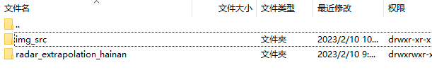

