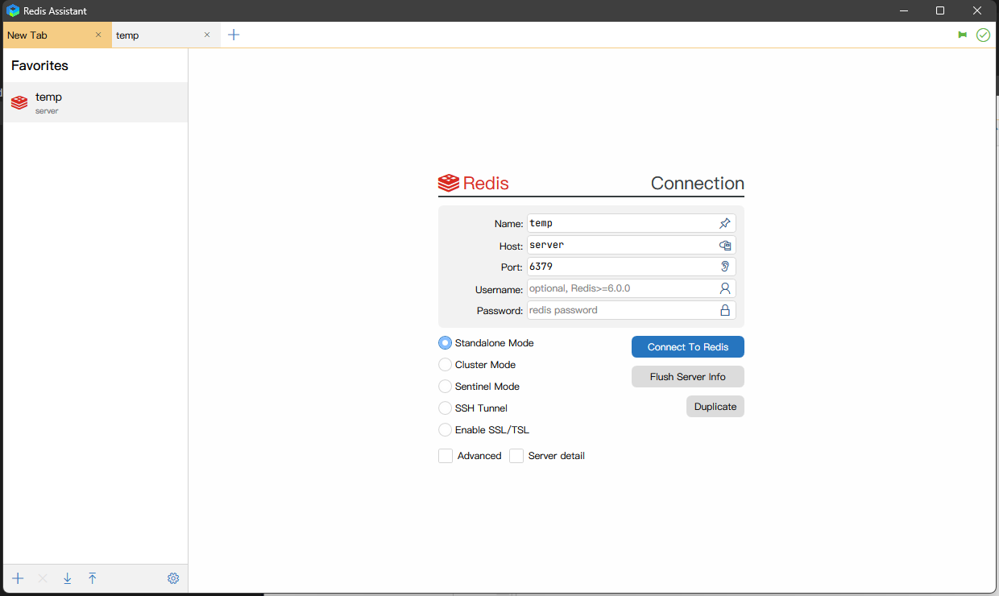
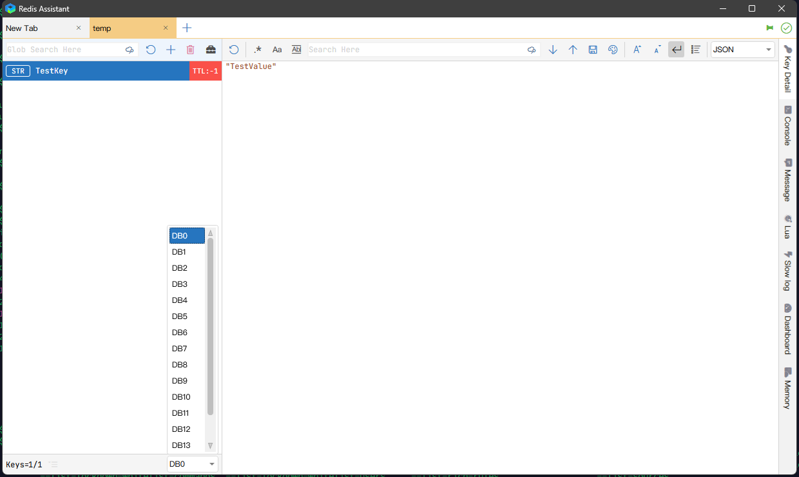

# 基于ARM架构服务器源码安装Redis

## 一.环境说明

| 名称  | 版本  | 下载地址                                                     |
| ----- | ----- | ------------------------------------------------------------ |
| Redis | 7.0.8 | http://alicefairy.ysepan.com/ [WorkSpace/成都润联科技开发有限公司/redis-7.0.8.tar.gz] |


- Redis源码安装包下载地址: https://github.com/redis/redis/releases 或 http://download.redis.io/releases/

## 二.Redis安装

```shell
# 解压redis到/usr/local/redis-7.0.8
sudo tar -zxvf redis-7.0.8.tar.gz -C /usr/local/
# 进入到redis父目录
cd /usr/local/
# 修改redis目录名称
sudo mv redis-7.0.8/ redis
# 进入deps目录
cd deps/
# 编译Redis依赖库
sudo make -j4 hiredis lua jemalloc linenoise
# 编译Redis
cd .. && sudo make -j4 && sudo make install
```

## 三.Redis的运行和配置

```shell
# 建立redis配置文件
cp redis.conf /usr/local/etc/
# 配置redis为后台启动
sudo sed -i 's/daemonize no/daemonize yes/g' /usr/local/etc/redis.conf
sudo sed -i 's/protected-mode yes/protected-mode no/g' /usr/local/etc/redis.conf
sudo sed -i 's/bind 127.0.0.1 -::1/#bind 127.0.0.1 -::1/g' /usr/local/etc/redis.conf
# 防火墙开放redis端口
sudo firewall-cmd --add-port=6379/tcp --permanent --zone=public
sudo firewall-cmd --reload
# redis的启动
/usr/local/bin/redis-server /usr/local/etc/redis.conf
# redis的关闭
kill -9 `ps -ef | grep -v grep | grep redis | awk '{print $2}'`
```

## 四.验证



