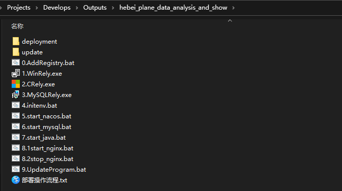
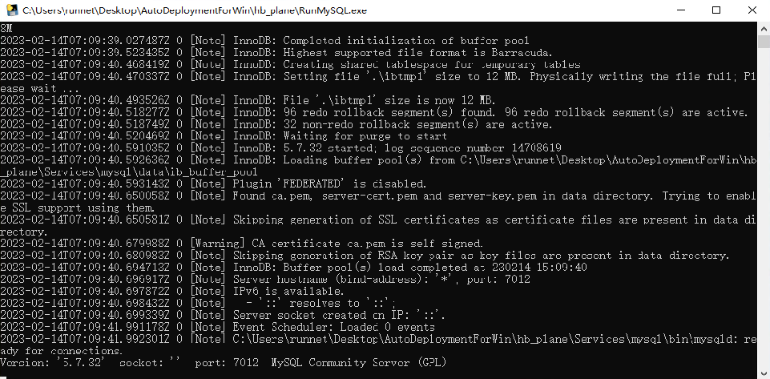
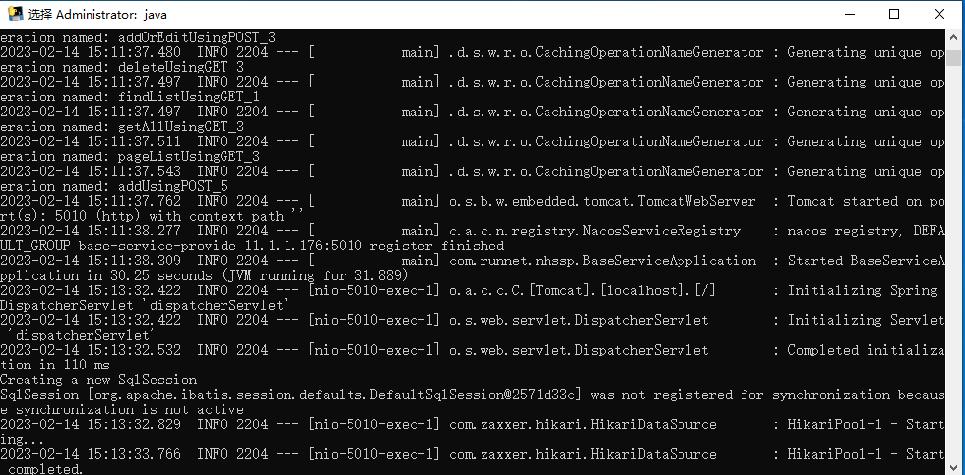

# 河北飞行数据分析与显示系统部署

自动部署目录结构

## 一.操作系统环境初始化

注: 环境初始化只执行一次

> 1. 管理员方式运行: `0.AddRegistry.bat` (运行该命令后设备会在1分钟后重新启动, 也可以手动进行设备重启)
> 2. 安装VC环境: 运行 `1.WinRely.exe` 注: 运行时间较长, 请耐心等待, 安装完成后会弹出提示框, 点击`finish`即可安装完成
> 3. 安装VC环境: 运行 `2.Crely.exe` 注: 安装完成后会弹出提示框, 点击`完成`即可安装完成
> 4. 安装MySQL运行VC环境: 运行 `3.MySQLRely.exe` 注: 安装完成后会弹出提示框, 点击`完成`即可安装完成
> 5. 初始化项目运行环境: 运行 `4.initenv.bat` 出现`continue...`字样按任意键关闭即可
>    - 注意事项: 
>      - 初始化环境只可以运行一次, 并且运行完成后不可以移动目录, 修改文件夹以及父文件夹目录名称
>      - 自动化部署包路径中不可包含中文路径

## 二.启动Nacos服务

>执行`5.start_nacos.bat` DOS窗口不要关闭

## 三.启动MySQL服务

> 执行`start_mysql.bat` DOS窗口不要关闭

## 四.启动Java后端服务

> 执行`start_java.bat`DOS窗口不要关闭

## 五.启动Nginx服务

> 执行`8.1start_nginx.bat`出现`continue...`字样按任意键关闭即可
>
> 浏览器访问: http://localhost:64201 即可

## 六.服务关闭

>1. 关闭`nacos`,`mysql`,`java`服务的运行DOS窗口即可
>2. 执行`8.2stop_nginx.bat`来关闭nginx服务