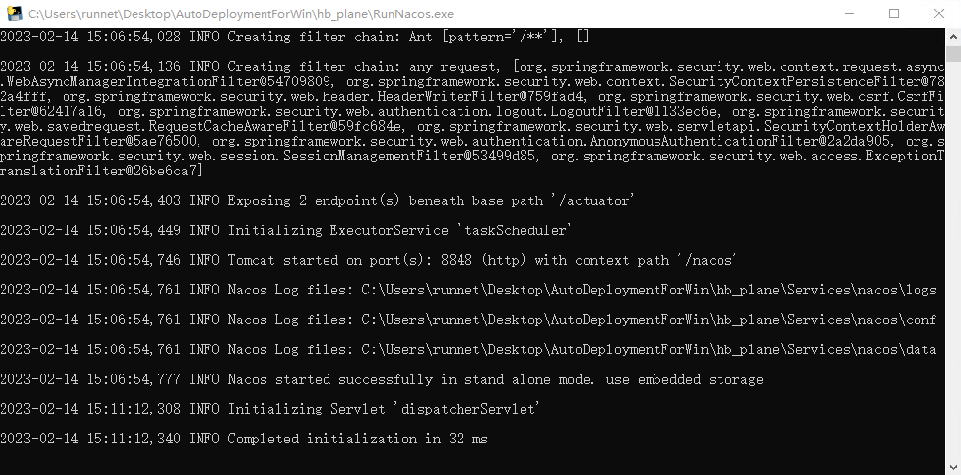

# 河北飞行数据分析与显示系统部署

**注意: 执行所有exe程序必须使用管理员运行(右击文件选择管理员运行)**

## 一.操作系统环境初始化

注: 环境初始化只执行一次

> 执行`Install.exe`

## 二.启动Nacos服务

>执行`RunNacos.exe`

## 三.启动MySQL服务

> 执行`RunMySQL.exe`

## 四.启动Java后端服务

> 执行`RunJava.exe`

## 五.启动Nginx服务

## 六.服务验证

## 七.访问Web

> http://本机IP:61001

## 八.注意事项

1. 服务器重启后从第二步开始执行
2. 部署路径不能包含中文